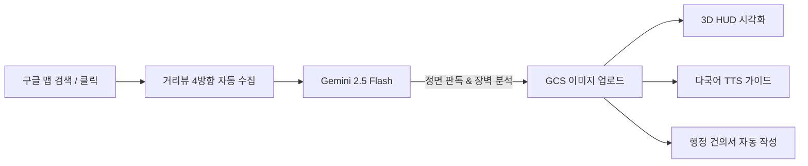
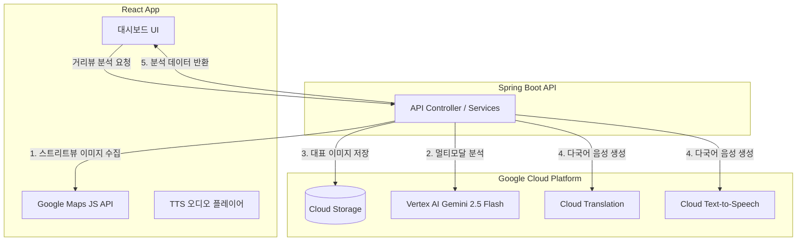

# 🗺️ ZeroStep

GCP Vertex AI, Google Maps Platform 및 Google Cloud AI API를 유기적으로 결합하여 보행 교통약자를 위한 물리 장벽 시각화, 음성 안내, 그리고 행정 개선 건의서 발급을 자동화하는 배리어프리 종합 솔루션입니다.

---

## 🌐 서비스 개요 및 핵심 가치

ZeroStep은 사용자가 장소를 검색하거나 지도를 클릭하면 구글 스트리트뷰를 통해 해당 위치의 입구 사진들을 자동 수집하고, Vertex AI Gemini가 단차와 장벽을 판독하여 3D HUD 투시 라인으로 시각화합니다. 이와 함께 다국어 음성 안내(TTS)와 교통약자법 제15조에 근거한 행정 건의서 자동 작성을 지원하여 교통약자의 보행권 보장을 돕습니다.

### 🔄 핵심 기능 및 서비스 흐름도



### 🎯 특장점, 차별성 및 기대효과
* **구글 클라우드 AI 네이티브 연동**: 이미지 탐색부터 GCS 적재, Gemini 멀티모달 분석, 번역 및 TTS 합성까지 모든 파이프라인이 100% Google Cloud 기술군으로 구성되어 처리 속도와 신뢰성이 극대화되었습니다.
* **장애 체험형 저변 확대**: 색약, 백내장, 저시력 상태를 체험할 수 있는 장애인 시각 시뮬레이터 기능을 내장하여 비장애인의 사회적 공감을 유도합니다.
* **시민 행동주의적 도구**: 단순 정보 제공에 머무르지 않고, 교통약자의 동등한 보행권 보장을 위해 실제 법률 조항(교통약자법 제15조)에 기반한 관할 행정청 제출용 개선 건의서를 즉시 발급해 인프라의 개선을 유도합니다.

---

## 🏛️ 아키텍처 및 시연 구조

### 아키텍처 구성도



### 시연 화면 구조

```text
┌────────────────────────────────────────────────────────────────────────┐
│                              [VITE HOST]                               │
├───────────────────────────────────┬────────────────────────────────────┤
│                                   │                                    │
│       [Google Maps Panel]         │      [Accessibility Sidebar]       │
│                                   │                                    │
│   - 구글 맵 & 마커 표기           │   - 언어 선택 (KO/EN/JA/ZH)        │
│   - 위치 검색 & 클릭 핀 매핑      │   - 시나리오 프리셋 선택           │
│   - 자동 거리뷰 수집 오버레이     │   - 실시간 이미지 업로드 분석      │
│                                   │   - 3D HUD 단차/경사 가이드 뷰     │
│                                   │   - TTS 음성 재생 / STT 음성 검색  │
│                                   │   - 행정 개선 건의서 발급 & 다운   │
│                                   │   - 시각 장애 체험 시뮬레이터      │
│                                   │                                    │
└───────────────────────────────────┴────────────────────────────────────┘
```

---

## 🛠️ Tech Stack

| Category | Technology & Tools |
| :---: | :--- |
| **Frontend** |     |
| **Backend** |    |
| **Google Cloud** |     |
| **Maps Platform** |   |


### 프로젝트 구조

```text
.
├─ frontend/
│  ├─ src/
│  │  ├─ App.jsx
│  │  ├─ main.jsx
│  │  └─ style.css
│  ├─ index.html
│  ├─ package.json
│  └─ vite.config.js
└─ backend/
   ├─ src/main/java/com/example/backend/
   │  ├─ BackendApplication.java
   │  ├─ controller/
   │  │  └─ AccessibilityController.java
   │  └─ service/
   │     ├─ GcpService.java
   │     └─ TtsTranslationService.java
   ├─ src/main/resources/application.properties
   ├─ build.gradle
   └─ settings.gradle
```

---

## 🤖 프로젝트 하네스 (Harness)

본 프로젝트는 AI 개발 에이전트인 **Antigravity**만을 사용하여 개발, 검증 및 리포지토리 릴리즈를 진행했습니다. 

로컬 푸시 및 빌드 시 정적 검사를 통과할 수 있도록 Git Hook 설정(`.githooks/`)이 적용되어 있으며, 커밋 메시지 작성 시 지정된 Unified Gitmoji 컨벤션이 자동으로 강제 검증됩니다.
